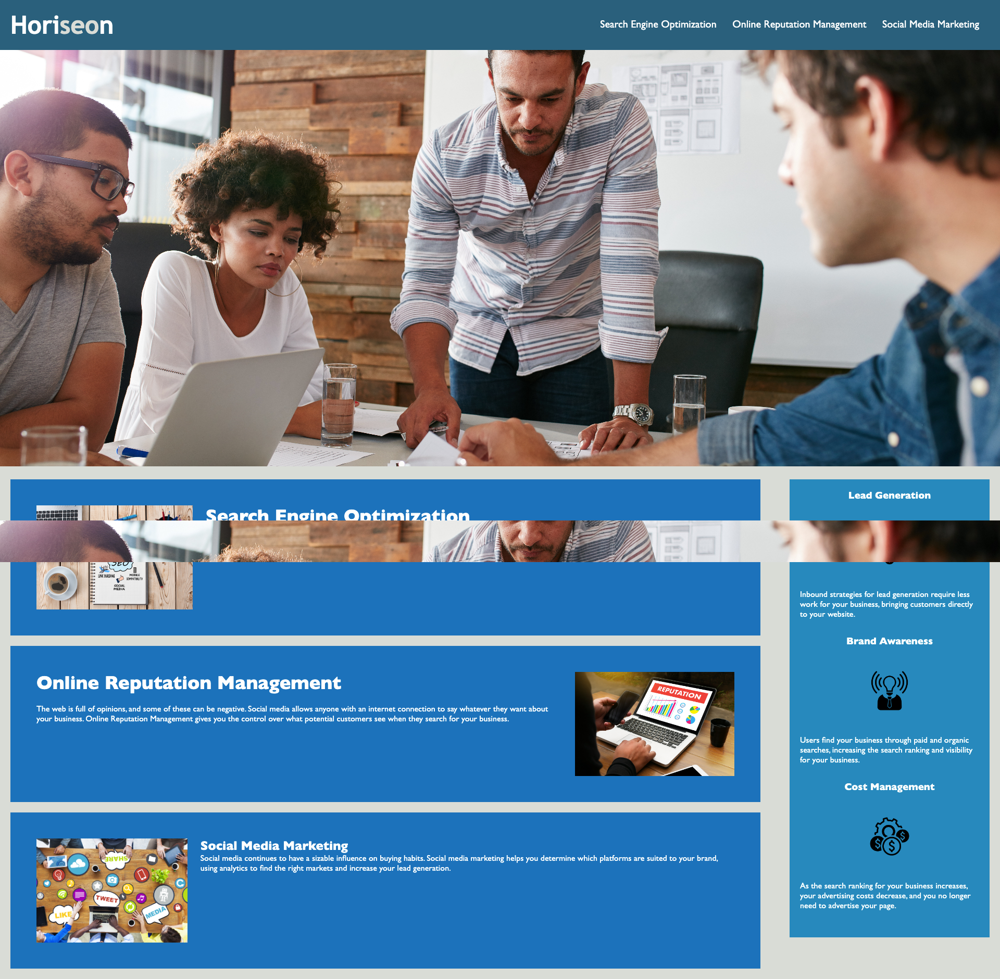

# Horison Insurance Group

## Description

This file serves as a guide for HTML and CSS style guide for Horison Insurance Group. The styles are organized based on the sections of the web page.

## Table of Contents

1. [The Task](#the-task)
2. [Install](#install)
3. [Languages Used](#languages-used)
4. [Screenshot](#Video)
5. [Links](#links)
6. [acknowledgements](#acknowledgements)
7. [credit](#credit)

## The Task

### User Story

- AS A marketing agency I WANT a codebase that follows accessibility standards
- SO THAT our own site is optimized for search engines

### Acceptance Criteria

- GIVEN a webpage meets accessibility standards
- WHEN I view the source code
- THEN I find semantic HTML elements
- WHEN I view the structure of the HTML elements
- THEN I find that the elements follow a logical structure independent of styling and positioning
- WHEN I view the image elements
- THEN I find accessible alt attributes
- WHEN I view the heading attributes
- THEN they fall in sequential order
- WHEN I view the title element
- THEN I find a concise, descriptive title

## Install

Steps to run application :

- Open the clone file

## Languages Used

- HTML
- CSS

## Screenshot:

## links

- [Github Repo](https://github.com/mdRashed30/HTML-and-CSS)

- [Deploy](https://mdrashed30.github.io/HTML-and-CSS/)

## acknowledgements :

-- Video tutorial

-- TA

## Credit:
